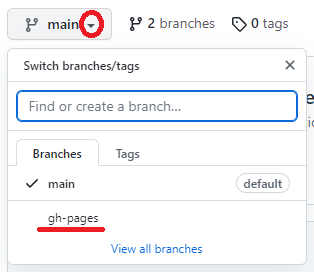

# Dataset-JSON React Demo

This repository shows how to setup react for Dataset-JSON as example.

## Description

The main purpose of this project is a demonstration. To see the react application deployed, visit the corresponding GitHub Pages [Demo](https://katjaglassconsulting.github.io/dataset-json-react-demo/).

## Contribution

Contribution is very welcome. When you contribute to this repository you are doing so under the below licenses. Please checkout [Contribution](CONTRIBUTING.md) for additional information. All contributions must adhere to the following [Code of Conduct](CODE_OF_CONDUCT.md).

## License

 

### Code & Scripts

This project is using the [MIT](http://www.opensource.org/licenses/MIT "The MIT License | Open Source Initiative") license (see [`LICENSE`](LICENSE)) for code and scripts.

### Content

The content files like documentation and minutes are released under [CC-BY-4.0](https://creativecommons.org/licenses/by/4.0/). This does not include trademark permissions.

## Re-use

When you re-use the source, keep or copy the license information also in the source code files. When you re-use the source in proprietary software or distribute binaries (derived or underived), copy additionally the license text to a third-party-licenses file or similar.

When you want to re-use and refer to the content, please do so like the following:

> Content based on [Dataset-JSON React Demo (GitHub)](https://github.com/KatjaGlassConsulting/dataset-json-react-demo) used under the [CC-BY-4.0](https://creativecommons.org/licenses/by/4.0/) license.

## Using React

This project was bootstrapped with [Create React App](https://github.com/facebook/create-react-app).

To use react you need to have the package manager NPM and node.js installed (https://docs.npmjs.com/downloading-and-installing-node-js-and-npm). Clone or download the source code. Then go into the project directory - in the console, you can run `npm install` to install all dependencies and afterwards `npm start` to start the application. The application in development mode then then be opened on [http://localhost:3000](http://localhost:3000) to view it in your browser. Finally `npm run build`  builds the app for production to the `build` folder. It correctly bundles React in production mode and optimizes the build for the best performance. There you have an index.html and through this your app can be started.

## Layout - Semantic-UI

There are various packages which come along with nice ready to use components for a phantastic layout. Next to matieral-ui which is well known, there is also semantic-ui.
I am using [semantic-ui](https://react.semantic-ui.com/). This needs a patch to work with the latest react-scripts version. Note that the package.json is updated with a required "postinstall".

## Pipeline & Deployment in GitHub Pages

A pipeline can easily be setup by creating a new file in `.github\worflows`, e.g. creating `buildDeploy.yml`. A nice pipeline setup is available [here](https://github.com/marketplace/actions/deploy-to-github-pages), which I copied over. After you committed this change, the Action runs immediately as the "main"-branch has been updated. At the "Actions" tab you can see the action running (brown running circle) and also see when it's finished (hopefully green tick mark). When the action is finished, you see that there is a new branch called "gh-pages". This is typically used for GitHub Pages.

Finally the repository needs to activate GitHub pages and specify the corresponding content branch. This can be done via Settings -> Pages. Select there the "gh-pages" branch and save. After a little time the page is deployed and visible. The URL can be derived from the original repository name.

Type | URL
-- | --
Repository | https://github.com/KatjaGlassConsulting/dataset-json-react-demo
GitHub Pages | https://katjaglassconsulting.github.io/dataset-json-react-demo/

Finally you might want to reference the live demo in the readme under the description. 